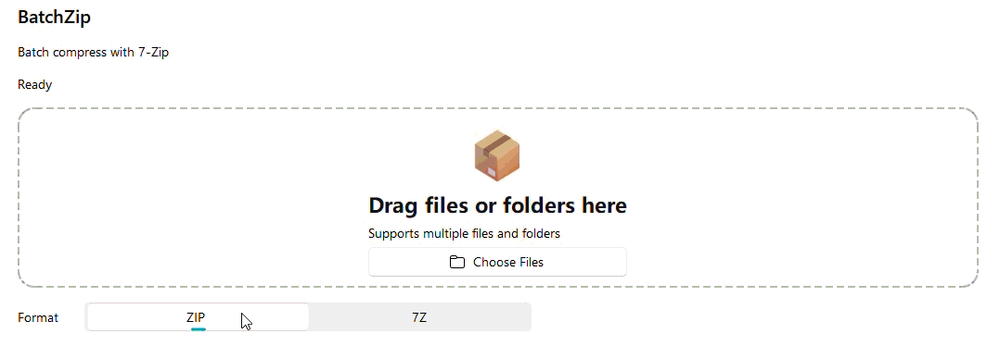
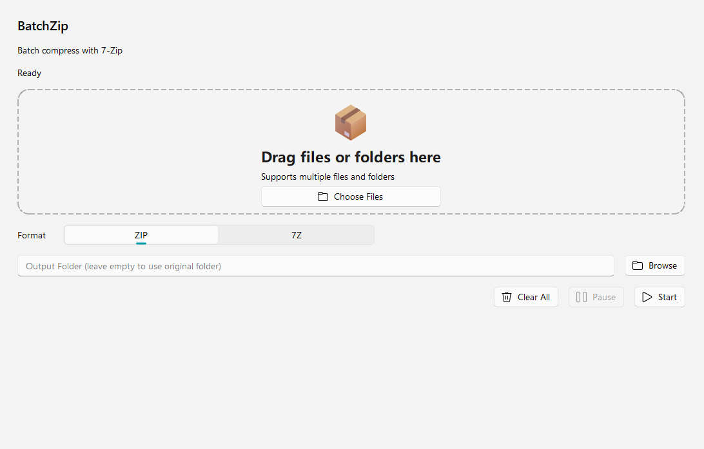
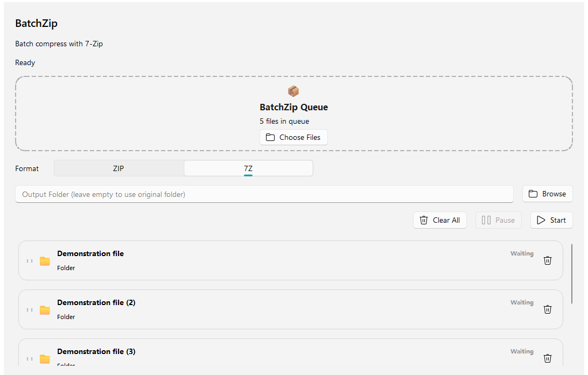

<p align="center">
  
</p>

# BatchZip

<p align="center">

<a href="https://github.com/KAKAzere/BatchZip/releases">

</a>

</p>


BatchZip is a modern batch compression tool for Windows, built with PySide6 and powered by 7-Zip.

It provides a simple graphical workflow for compressing multiple files and folders without relying on command-line operations. BatchZip supports task queues, ZIP and 7Z formats, real-time progress tracking, pause and resume, cancellation, and flexible output management.

---

## ✨ Features

- Compress multiple files and folders in one queue.
- Create ZIP or 7Z archives.
- Drag and drop files and folders, or select them with dedicated buttons.
- Reorder queued tasks.
- Show real 7-Zip progress with an indeterminate fallback when progress data is unavailable.
- Pause, resume, or cancel the active compression task.
- Automatically remove incomplete archives after cancellation or unexpected failures.
- Automatically locate 7-Zip through PATH, Windows Registry, and common installation folders.
- Classify compression errors and provide clear recovery suggestions.
- Avoid overwriting existing archives by generating unique output names.
- Show completion summaries, detailed failure information, sound notifications, and optional Windows notifications.
- Follow the system light or dark theme.

---

## 🎬 Demo

Switch between **ZIP** and **7Z** formats with a single click.

<p align="center">
  
</p>

---

## 🖼️ Preview

<p align="center">
  
  
</p>

<p align="center">
  <sub>Left: Home screen · Right: Queue after adding files</sub>
</p>

---

## 📋 Requirements

- Windows 10 or Windows 11
- Python 3.12 or later when running from source
- [7-Zip](https://www.7-zip.org/) installed on the computer

---

## 🚀 Run from source

Clone the repository:

```powershell
git clone https://github.com/KAKAzere/BatchZip.git
cd BatchZip
```

Create a virtual environment:

```powershell
python -m venv .venv
.\.venv\Scripts\Activate.ps1
```

Install dependencies:

```powershell
python -m pip install -r requirements.txt
```

Run:

```powershell
python main.py
```

---

## 📦 Build the Windows executable

Run:

```powershell
.\build.bat
```

The finished executable will be created at:

```text
dist\BatchZip.exe
```

The packaged application still requires 7-Zip to be installed.

BatchZip does not redistribute 7-Zip.

---

## 📁 Project Structure

```text
BatchZip
├── assets
│   ├── icon
│   └── images
│       ├── banner.svg
│       └── preview
│           ├── demo.gif
│           ├── home.png
│           └── queue.png
│
├── core
│   └── Compression logic
│
├── ui
│   └── User interface
│
├── tests
│   └── Test cases
│
├── tools
│   └── Utility scripts
│
├── releases
│   ├── v1.0.0-rc2.md
│   └── v1.0.0-rc3.md
│
├── main.py
└── BatchZip.spec
```

---

## 📂 Output Naming

BatchZip never silently overwrites existing archives.

If:

```text
report.zip
```

already exists, the next archive will be named:

```text
report (2).zip
```

followed by:

```text
report (3).zip
```

and so on.

---

## 🧪 Testing

BatchZip has been tested on:

```text
Windows 11 Home 25H2
Clean Virtual Machine Environment
```

Current release candidate:

```text
v1.0.0-rc3
```

Verified:

- ✅ Standalone EXE startup
- ✅ No Python environment required
- ✅ Missing 7-Zip detection
- ✅ 7-Zip launch failure handling
- ✅ ZIP compression
- ✅ 7Z compression
- ✅ Archive extraction verification
- ✅ Unicode path compatibility
- ✅ Chinese, Japanese, and special character paths
- ✅ Failed compression cleanup
- ✅ Unexpected failure recovery

Automated regression tests:

```text
19 tests passing
```

---

## 📝 Release Notes

Detailed release notes for each version are available in the `releases` directory.

---

## 🛠️ Technology Stack

Built with:

- Python
- PySide6
- PySide6-Fluent-Widgets
- 7-Zip

---

## 📄 License

BatchZip is released under the MIT License.

See [LICENSE](LICENSE) for details.
```